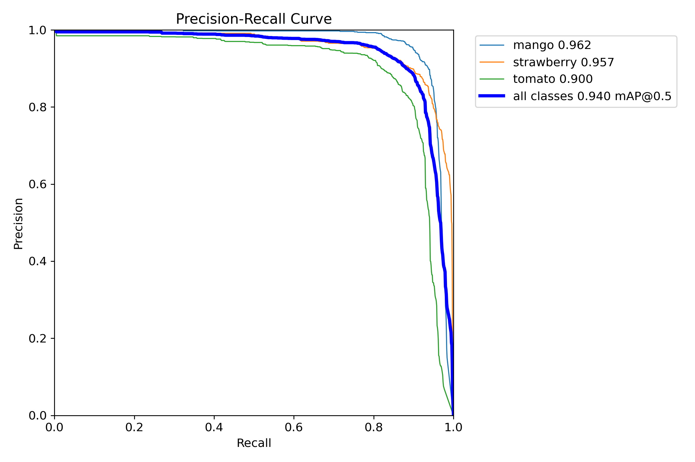

# AI Crop Maturity Detection System

Detects crops from a live webcam feed, classifies every fruit as Unripe, Ripe or Overripe and tells you if it is ready to harvest. Works for tomato, mango and strawberry.

Detection is done with a YOLOv5s model, maturity classification with a MobileNetV2 model. Everything runs on CPU, no GPU needed.

## How it works

1. The browser captures the webcam and sends JPEG frames as base64 over a WebSocket.
2. FastAPI decodes the frame and runs YOLOv5s detection (loaded through torch.hub from third_party/yolov5).
3. A centroid tracker keeps the same ID on each fruit between frames.
4. Every detected fruit is cropped out of the frame and passed to the maturity model.
5. config/crops.yaml turns the predicted stage into harvest readiness, estimated harvest time and storage temperature.
6. The backend sends JSON back and the React dashboard draws boxes and labels on the video.

## Project structure

```
AI_Crop_Maturity_Detection_System/
├── backend/             FastAPI app (routes, schemas, pipeline service)
│   ├── main.py
│   ├── routes/          /ws/detect websocket and /analysis/detect upload
│   ├── schemas/         Response models
│   └── services/        DetectionPipeline (detector, tracker, both engines)
├── cv/                  YOLOv5s detector wrapper and centroid tracker
├── analysis/
│   ├── maturity/        Maturity model code (predict_maturity)
│   └── harvest/         Harvest rules code (predict_harvest)
├── config/
│   └── crops.yaml       Stages, harvest rules and temperatures per crop
├── models/
│   ├── detection/       Trained YOLOv5s weights
│   └── maturity/        MobileNetV2 model and class labels
├── frontend/            React + Vite dashboard
├── notebooks/           Training notebooks for both models
├── tests/               Pytest tests for the maturity and harvest code
├── third_party/yolov5/  YOLOv5 code loaded through torch.hub
├── data/                Dataset download links
├── evaluation/          Detector evaluation files (Drive link)
├── reports/             Detector training metrics (Drive link)
├── backend.Dockerfile
├── docker-compose.yml
└── requirements.txt
```

## Backend setup

```bash
python -m venv .venv
.venv\Scripts\activate
# source .venv/bin/activate on mac/linux

pip install -r requirements.txt
uvicorn backend.main:app --reload --port 8080
```

Run this from the project root, the model paths are relative to it. The frontend expects the backend on port 8080.

## Frontend setup

```bash
cd frontend
npm install
npm run dev
```

Open http://localhost:5173 and allow camera access. In dev mode it connects to ws://127.0.0.1:8080/ws/detect (see frontend/.env.development).

## Tests

```bash
python -m pytest tests/ -q
```

Run from the project root. The tests cover the maturity model output, the stage mapping and the harvest rules.

## Evaluation

### Crop detection (YOLOv5s)

Numbers from the last detector training run. The full curves are in tests/images/:

- mAP@0.5: 0.94 over all classes (mango 0.96, strawberry 0.96, tomato 0.90)
- Best F1: 0.89 at confidence 0.495, the runtime threshold of 0.40 sits just below it
- Precision around 0.89, recall around 0.87 on the validation set
- 95% of mango and strawberry cases and 91% of tomato cases are detected correctly. Most wrong detections are background regions predicted as fruit (0.26 to 0.38 depending on class, see tests/images/confusion_matrix.png)



### Maturity classification (MobileNetV2)

Trained on the Kaggle fruits ripeness classification dataset with 80% of the images for training and 20% held out for testing, split per class. The dataset covers five fruits and the model generalizes to strawberry, which is not one of them.

A training run on this dataset reaches about 66% test accuracy. The dataset names the overripe stage inconsistently (an Overipe folder and an Overripe folder), so the model trains on four classes instead of three, which lowers the measured accuracy. Looking at the three real stages, about 83% of unripe, 66% of ripe and 32% of overripe test images are classified correctly; most missed overripe images are called ripe or unripe. The engine maps the typo label back to Overripe at runtime, so the duplicate label affects the measured numbers but not the running system.

Step 8 of notebooks/Train_Maturity_Model.ipynb prints the test accuracy, per-class precision, recall and F1 and a confusion matrix for each training run.

On a normal laptop CPU one fruit takes about 70 to 90 ms to classify.

## Docker

```bash
docker compose up --build
```

Frontend on http://localhost, backend on http://localhost:8080. The nginx config forwards /ws/ and /api/ to the backend, so the built frontend works without extra settings.

## API

- ws://host:8080/ws/detect - live detection, frame in, results out
- POST /analysis/detect - single image upload
- GET /health - health check

Request sent over the websocket:

```json
{
  "image": "<base64 JPEG>",
  "settings": {
    "confidence": 0.40,
    "resolution": 640,
    "clahe": false,
    "reset_tracker": false
  }
}
```

Answer for each detected fruit:

```json
{
  "object_id": "1",
  "crop": "tomato",
  "confidence": 0.87,
  "bbox": [120, 80, 240, 220],
  "maturity": { "stage": "Ripe", "score": 93 },
  "harvest": { "readiness": "high", "estimated_time": "now" },
  "temperature": "18-21 C"
}
```

## Crop config

Crop behavior lives in config/crops.yaml:

```yaml
tomato:
  optimal_temperature: "18-21 C"
  stages: [Unripe, Ripe, Overripe]
  harvest_rules:
    Unripe:   { readiness: low,  time: "7-14 days" }
    Ripe:     { readiness: high, time: "now" }
    Overripe: { readiness: high, time: "now" }
```

To add a crop, add a block like this with its own stages and rules. The stage names here must match what the maturity model can output.

## Models

- models/detection/yolov5s_trained.pt - YOLOv5s weights for crop detection
- models/maturity/maturity_model.h5 - MobileNetV2, takes 224x224 images
- models/maturity/class_labels.json - output class names in order

analysis/maturity/engine.py maps the model output classes to the stage names used in crops.yaml.

## Training notebooks

- notebooks/Train_Maturity_Model.ipynb - maturity model, trained on the Kaggle fruits ripeness dataset
- notebooks/yolov5_training.ipynb - crop detector, the weights go to models/detection/
